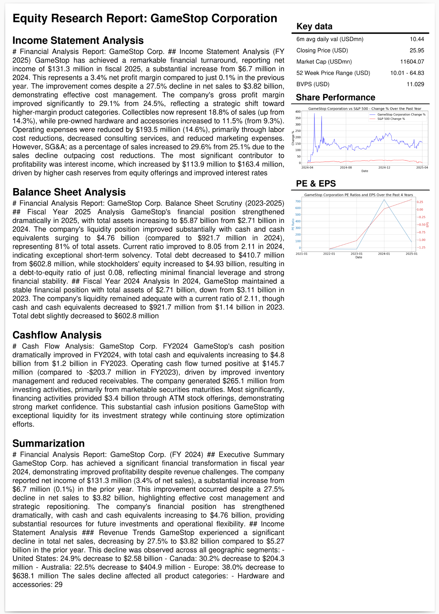

# Financial Report Analysis Project

## Overview

This notebook generates PDF report with financial analysis of stock company balance sheets and cashflow statement.\
See examples of generated reports in projects dir and run notebook for any other stock company by replacing ticker_symbol value:\
[GameStop GME_report.pdf](projects/GME/GME_report.pdf)\
[Tesla TSLA_report.pdf](projects/TSLA/TSLA_report.pdf)\
[Google GOOG_report.pdf](projects/GOOG/GOOG_report.pdf)



This project is a modified and improved version of notebook included in FinGPT project: \
https://github.com/AI4Finance-Foundation/FinGPT/tree/master/fingpt/FinGPT_FinancialReportAnalysis

Key improvements:
- Replaced LLM OpenAI/ollama with AWS Bedrock API
- Used Claude 3.7 Sonnet LLM
- Modified prompt to include numbers in text - to simplify verifying interpretation is correct

This project provides tools for analyzing financial reports, specifically annual reports (10-K), using advanced language models such as GPT-4 or other locally deployed Large Language Models (LLM). It's designed to help users generate comprehensive analysis reports in PDF format, offering insights into a company's financial health and performance over the fiscal year.

## Features

- **PDF Report Generation**: Automatically generate detailed analysis reports in PDF format for annual financial statements.
- **GPT-4 and LLM Support**: Utilize the power of GPT-4 or any locally deployed LLM for deep and insightful analysis.
- **Customizable Analysis**: Users can modify the analysis scope by choosing different company symbols and models.
- **Easy to Use**: Designed with simplicity in mind, simply run all cells in the provided notebook to get your report.

## Requirements

Before starting, ensure you have the following installed:
- Python 3.11 or later
- Jupyter Notebook
- Necessary Python packages (pandas, matplotlib, openai, etc.)

Obtain AWS keys: aws_access_key_id and aws_secret_access_key. \ 
Modify policies in IAM on AWS console to enable access to Bedrock service.\ 
Go to bedrock service, then to model catalog and enable LLM model used in jupyter notebook, for example Claude 3.7 Sonnet.

Obtain the sec-api (which is used to grab the 10-K report) from https://sec-api.io/profile for free.

(Optional) Obtain the fmp api for target price (paid) from https://site.financialmodelingprep.com/developer/docs/dashboard.

## Getting Started

To begin analyzing financial reports:

1. **Obtain API keys** described in Requirements section above. \ 
Create .env file in main project directory and put there obtained API keys:\
```
aws_access_key_id=put_your_key_here
aws_secret_access_key=put_your_key_here
sec_api_key=put_your_key_here
```

2. **Install python packages**:\
   `pip install -r requirements.txt`


3. **Open the Notebook**:
   Launch Jupyter Notebook and open the [financial_reports_analysis_with_AI_AWS_bedrock.ipynb](financial_reports_analysis_with_AI_AWS_bedrock.ipynb) file:
   ```
   jupyter notebook financial_reports_analysis_with_AI_AWS_bedrock.ipynb
   ```
   All the necessary libraries and dependencies are already imported in the notebook.

4. **Configure the Notebook**:
   Modify the `ticker_symbol` variable within the notebook to suit the analysis you wish to perform.

5. **Run the Analysis**:
   Execute all cells in the notebook to generate your financial report analysis in PDF format.

## Contributing

We welcome contributions and suggestions! Please open an issue or submit a pull request with your improvements.
